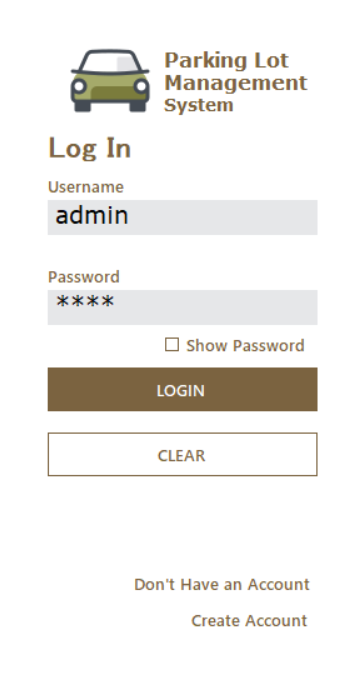
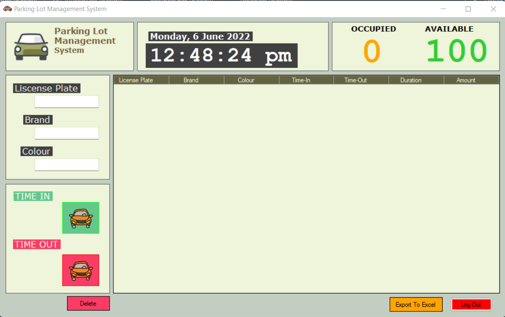
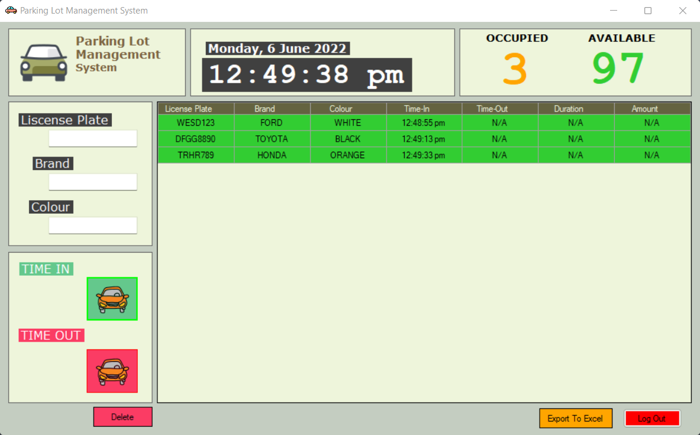
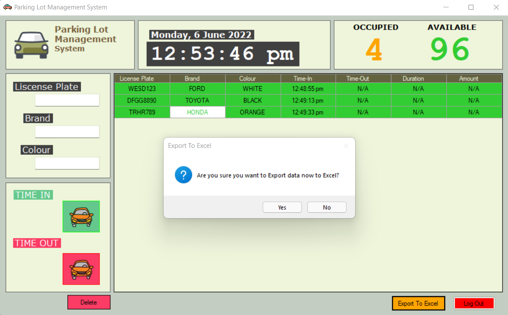
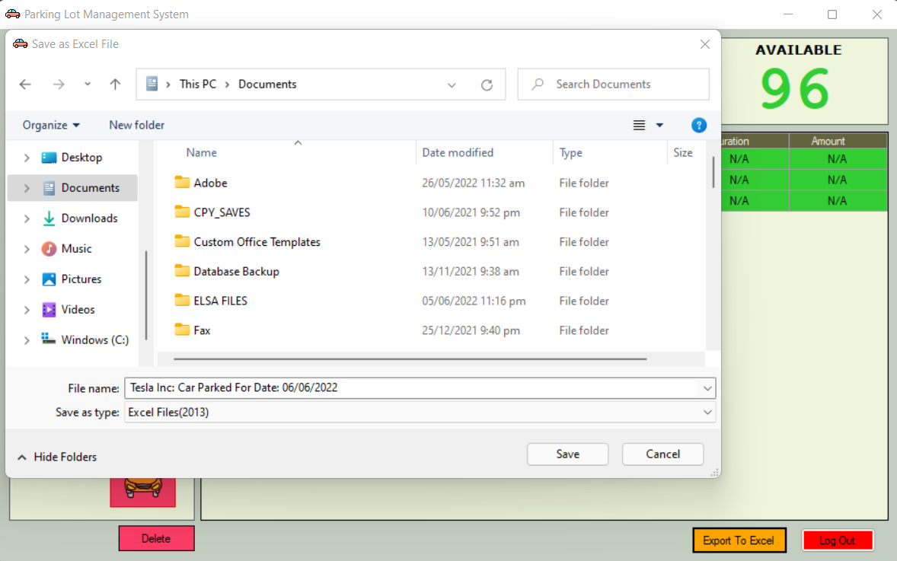
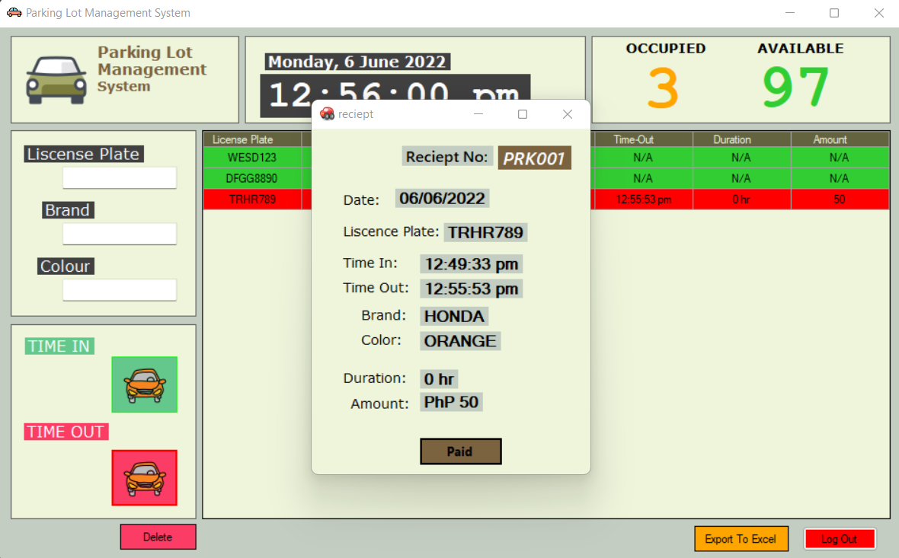
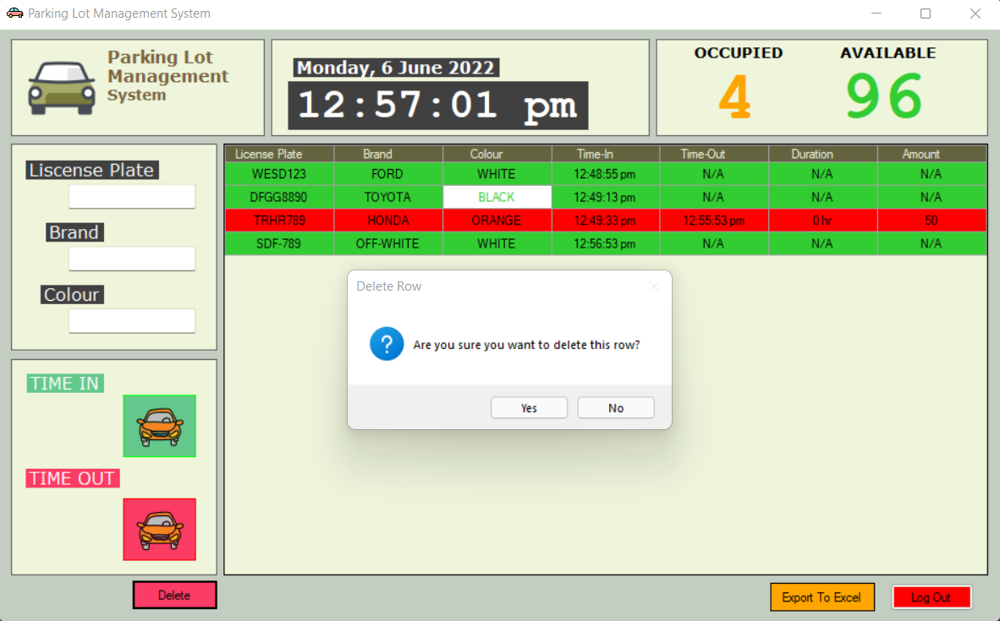

# ParkingSystem
<b>This app is made using C# Winforms and Microsoft Access for storing data. 
Features:</b> 
<ul>
  <li>Login Page to make sure authorized user can only access the app.</li>
  <li>The app has an export excel fuction that will generate report automatically.</li>
  <li>The App has an real time update on the available Parking Slot.</li>
  <li>It has an column marker green for cars who's still inside the parking lot, and red for those who leave the parling lot.</li>
  <li>The App Automatically compute the total parking fee depending on the time registered on the parking lot.</li>
</ul>
<b>Screenshot for the Parking System App</b> 
 
 
 
 
 
 
 
 
